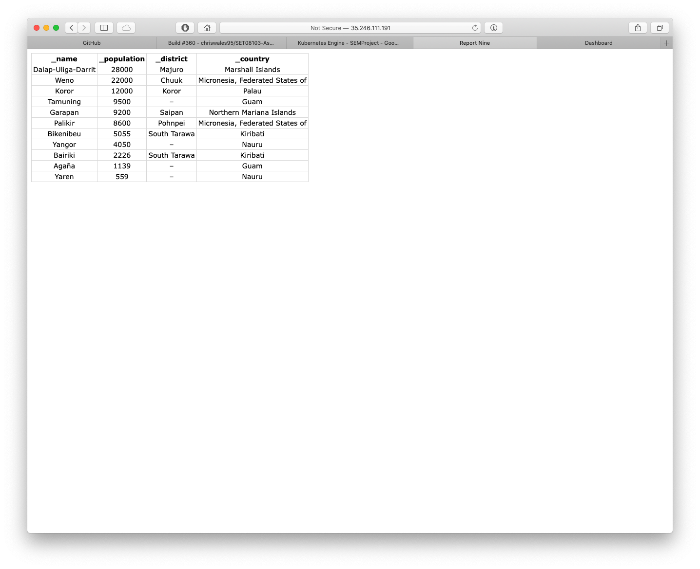
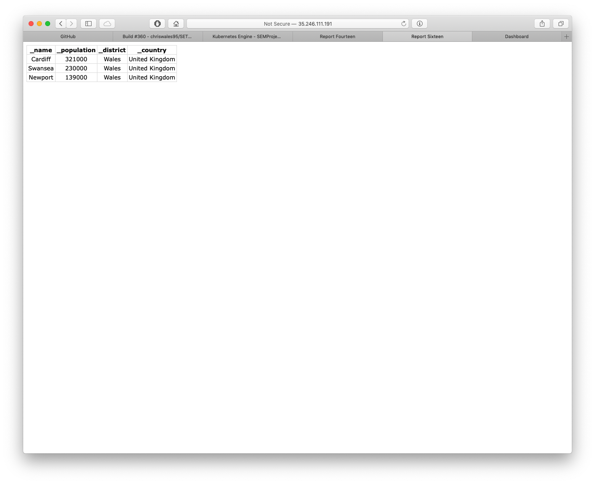
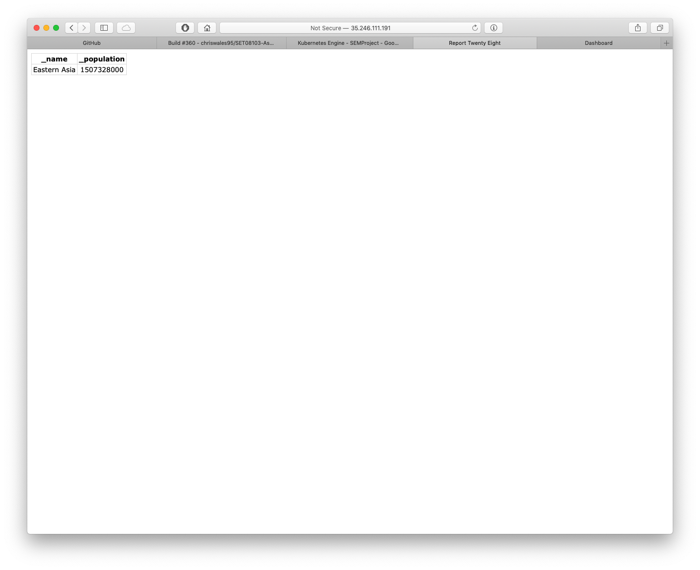

# SET08103-Assessment
Team assessment for SET08103 Software Engineering Methods 

- Master Build Status 

- Develop Build Status 

- License 

- Code Coverage 

- Release 

| ID | Name | Met | Screenshot |
| --- | --- | --- | --- |
| 1 | All the countries in the world organised by largest population to smallest. | Yes |  |
| 2 | All the countries in a continent organised by largest population to smallest. | Yes |  |
| 3 | All the countries in a region organised by largest population to smallest. | Yes |  |
| 4 | The top N populated countries in the world where N is provided by the user. | Yes |  |
| 5 | The top N populated countries in a continent where N is provided by the user. | Yes |  |
| 6 | The top N populated countries in a region where N is provided by the user. | Yes |  |
| 7 | All the cities in the world organised by largest population to smallest. | Yes |  |
| 8 | All the cities in a continent organised by largest population to smallest. | Yes |  |
| 9 | All the cities in a region organised by largest population to smallest. | Yes |  |
| 10 | All the cities in a country organised by largest population to smallest. | Yes |  |
| 11 | All the cities in a district organised by largest population to smallest. | Yes |  |
| 12 | The top N populated cities in the world where N is provided by the user. | Yes |  |
| 13 | The top N populated cities in a continent where N is provided by the user. | Yes |  |
| 14 | The top N populated cities in a region where N is provided by the user. | Yes |  |
| 15 | The top N populated cities in a country where N is provided by the user. | Yes |  |
| 16 | The top N populated cities in a district where N is provided by the user. | Yes |  |
| 17 | All the capital cities in the world organised by largest population to smallest. | Yes |  |
| 18 | All the capital cities in a continent organised by largest population to smallest. | Yes |  |
| 19 | All the capital cities in a region organised by largest to smallest. | Yes |  |
| 20 | The top N populated capital cities in the world where N is provided by the user. | Yes |  |
| 21 | The top N populated capital cities in a continent where N is provided by the user. | Yes |  |
| 22 | The top N populated capital cities in a region where N is provided by the user. | Yes |  |
| 23 | The population of people, people living in cities, and people not living in cities in each continent. | Yes |  |
| 24 | The population of people, people living in cities, and people not living in cities in each region. | Yes  |  |
| 25 | The population of people, people living in cities, and people not living in cities in each country. | Yes |  |
| 26 | The population of the world. | Yes  |  |
| 27 | The population of a continent. | Yes |  |
| 28 | The population of a region. | Yes |  |
| 29 | The population of a country. | Yes |  |
| 30 | The population of a district. | Yes |  |
| 31 | The population of a city. | Yes | |
| 32 | The population of Chinese speakers. | Yes |  |
| 33 | The population of English speakers. | Yes |  |
| 34 | The population of Hindi speakers. | Yes |  |
| 35 | The population of Spanish speakers. | Yes |  |
| 36 | The population of Arabic speakers. | Yes |  |
